## Trade Analysis by Category

We evaluated trade data on Bancor in the date range 2021-01-01 to 2022-02-13.

Tokens were divided into the following categories:
- **STABLE**: USDC, USDT, DAI
- **ETH**: ETH, WETH
- **BTC**: WBTC, renBTC
- **ALT**: All others (including BNT)

### Complete dataset (i.e. All-legs)
Unsurprisingly, ALT-ALT category comprises ~50% of volume due to 2-hops going through BNT.
The next biggest categories are ETH-ALT which makes 30%, and STABLE-ALT 14%.
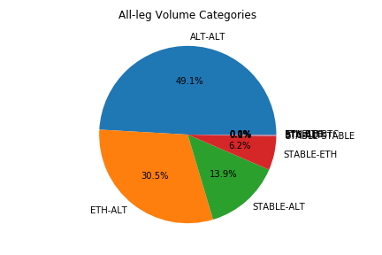 

The proportion of fees is very similar with the notable differences being the ALT-ALT and STABLE-ALT have higher Fee/Vol then ETH-ALT and so account for proportionately more fees.
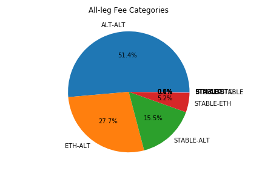

Stacked linearly we can see the dominance of each group over the next.
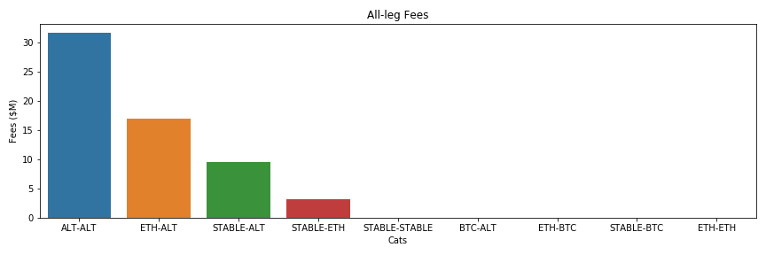

Interestingly, when we evaluate the actual fee rate across all trades we see the ETH-containing categories lagging behind due to the low fees implemented on our ETH pool.
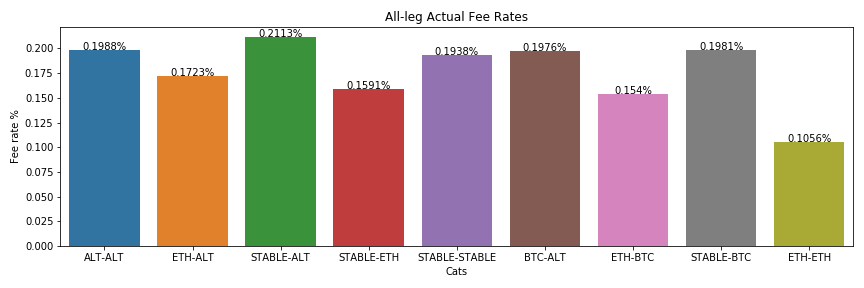

### Comparing Legs
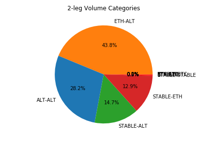 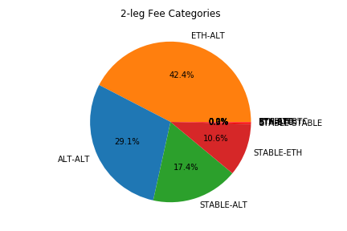
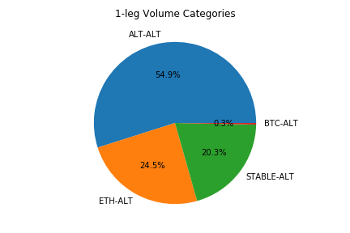  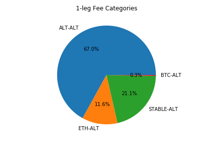 
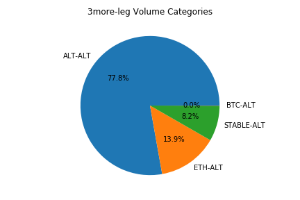 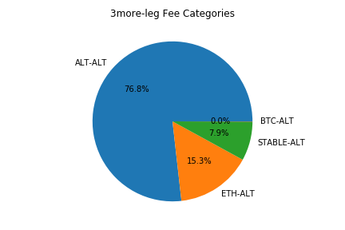 

# ETHBNT

ETHBNT pool fee
- 85% of ETH trades are 2hop
- these trades make up 50% of all Bancor volume 
- 17.7% of all Bancor fees are from ETH

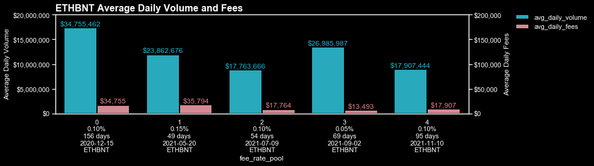

 
 

## Previous Notes

<html>
<body>
    <object id="obj" width="" height="" data="20220208-EconMeetingNotes.pdf" type="application/pdf">
        
No online PDF viewer installed

    </object>
</body>
</html>