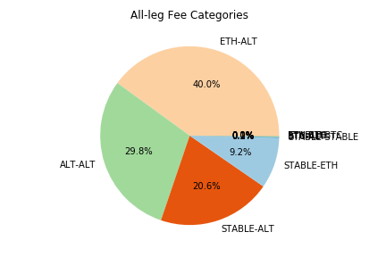
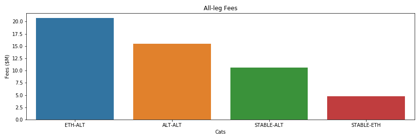
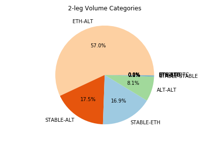
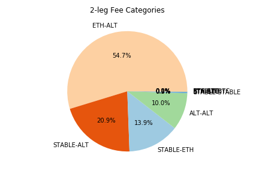
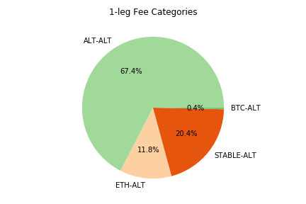
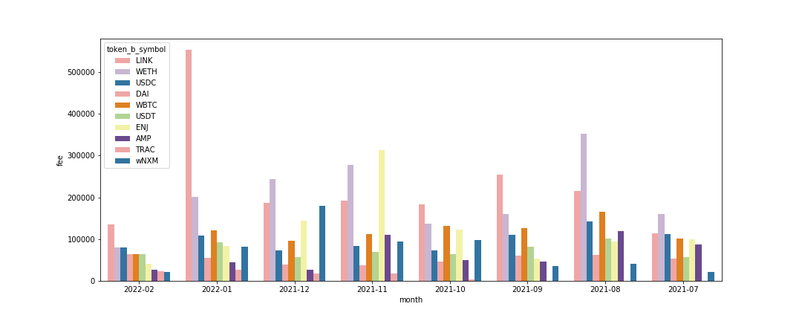
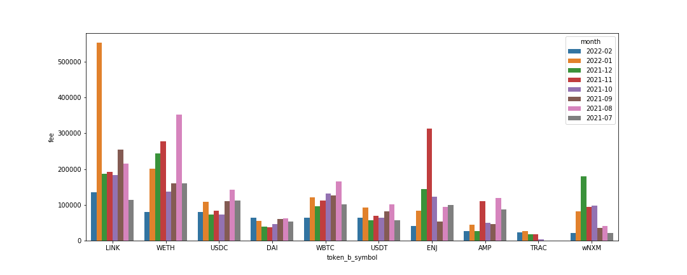

 

## Agenda
1. Volume and Fee Revenue Breakdown by Token Category
1. Monthly Fee Revenue by TKN
1. ETH Fee Change Considerations
1. Fee Breakdown by Traders

<!-- 1. Dashboard site
1. Top Traders and Wintermute Accounts
    - **Wintermute 1**: 0x0000006daea1723962647b7e189d311d757Fb793
    - **Wintermute 2** (Bancor Primary): 0x000002Cba8DfB0a86A47a415592835E17fac080a
    - **Wintermute Binance Deposit**: 0xB3f923eaBAF178fC1BD8E13902FC5C61D3DdEF5B
    - **Wintermute**: 0x0e5069514a3Dd613350BAB01B58FD850058E5ca4 -->

 
 

## Trade Analysis by Category

We evaluated trade data on Bancor in the date range 2021-01-01 to 2022-02-28.

Tokens were divided into the following categories:
- **STABLE**: USDC, USDT, DAI
- **ETH**: ETH, WETH
- **BTC**: WBTC, renBTC
- **ALT**: All others (including BNT)

### Complete dataset (i.e. All-legs)
The ETH-ALT category is our largest volume comprising ~46% and generates 40% of our fees.
The next biggest category is ALT-ALT which makes 24% of the volume and 30% of the fees.
The STABLE-ALT category makes 18% of the volume and 20% of the fees.

  

### Comparing Legs

- 2-leg: Source and Target ignoring BNT

 

- 1-leg: TKN and BNT (ALT)

   

## Monthly Fee Revenue by Target TKN

 
 

## ETH Fee change
- What percentage of txns would it effect?
    - ETH is target token in 15.7% of trades
    - $4.3M (8.3%) in fees since 2021
- What additional revenue would we have made in the last month?
    - In the last month we did $80k of ETH fees (5.2% of the protocol)
    - An increase from 0.1% -> 0.15% would be equivalent to $120k (assuming no volume change)
- What does a ETH volume drop mean for volume across the protocol and subsequent fees?
    - With this 50% increase in fees we could take a 30% hit in volume and still positive on fees.
- Note
    - All multi-leg (>=3) txns only account for 1.3% of fees ($680k) since 2021 so ETH fees here are not considerable.

 

## Fee Breakdown by Traders
The top 10 traders account for 68% of all fees on the protocol.

<table border="1" class="dataframe">
  <thead>
    <tr style="text-align: right;">
      <th></th>
      <th>trader</th>
      <th>volume_M</th>
      <th>fee_M</th>
      <th>rate</th>
      <th>perc_of_all</th>
      <th>perc_cuml</th>
    </tr>
  </thead>
  <tbody>
    <tr>
      <th>0</th>
      <td>0x000000370531eee8149ed162d387aad537899ac7</td>
      <td>$4,040</td>
      <td>$8.52</td>
      <td>0.211%</td>
      <td>16.45%</td>
      <td>16.45%</td>
    </tr>
    <tr>
      <th>1</th>
      <td>0xa57bd00134b2850b2a1c55860c9e9ea100fdd6cf</td>
      <td>$3,062</td>
      <td>$6.16</td>
      <td>0.201%</td>
      <td>11.89%</td>
      <td>28.34%</td>
    </tr>
    <tr>
      <th>2</th>
      <td>0x4d246be90c2f36730bb853ad41d0a189061192d3</td>
      <td>$2,055</td>
      <td>$3.78</td>
      <td>0.184%</td>
      <td>7.30%</td>
      <td>35.65%</td>
    </tr>
    <tr>
      <th>3</th>
      <td>0x0000000000007f150bd6f54c40a34d7c3d5e9f56</td>
      <td>$2,020</td>
      <td>$3.38</td>
      <td>0.167%</td>
      <td>6.52%</td>
      <td>42.17%</td>
    </tr>
    <tr>
      <th>4</th>
      <td>0x22f9dcf4647084d6c31b2765f6910cd85c178c18</td>
      <td>$1,495</td>
      <td>$2.93</td>
      <td>0.196%</td>
      <td>5.66%</td>
      <td>47.83%</td>
    </tr>
    <tr>
      <th>5</th>
      <td>0x28fdc585ce394bc9d78f03a01d61958ac87de2df</td>
      <td>$1,488</td>
      <td>$2.67</td>
      <td>0.179%</td>
      <td>5.15%</td>
      <td>52.98%</td>
    </tr>
    <tr>
      <th>6</th>
      <td>0xfd3dfb524b2da40c8a6d703c62be36b5d8540626</td>
      <td>$1,247</td>
      <td>$2.49</td>
      <td>0.200%</td>
      <td>4.81%</td>
      <td>57.79%</td>
    </tr>
    <tr>
      <th>7</th>
      <td>0xe069cb01d06ba617bcdf789bf2ff0d5e5ca20c71</td>
      <td>$1,043</td>
      <td>$1.68</td>
      <td>0.161%</td>
      <td>3.25%</td>
      <td>61.03%</td>
    </tr>
    <tr>
      <th>8</th>
      <td>0xdb38ae75c5f44276803345f7f02e95a0aeef5944</td>
      <td>$1,034</td>
      <td>$1.93</td>
      <td>0.187%</td>
      <td>3.73%</td>
      <td>64.76%</td>
    </tr>
    <tr>
      <th>9</th>
      <td>0x27239549dd40e1d60f5b80b0c4196923745b1fd2</td>
      <td>$1,024</td>
      <td>$1.94</td>
      <td>0.189%</td>
      <td>3.74%</td>
      <td>68.51%</td>
    </tr>
  </tbody>
</table>